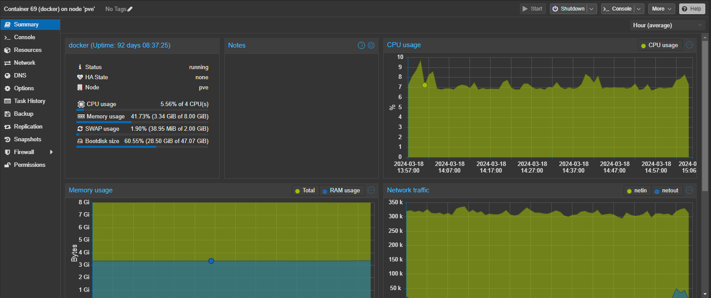
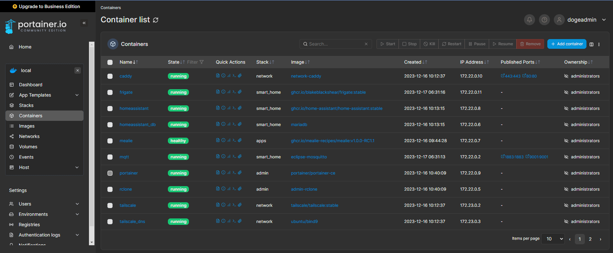

# Doge's Home Server Stack

A set of configurations to instantiate your own home server stack using Proxmox. All the LXC containers host docker containers.

## Main LXC

Main LXC host the docker containers for the following docker compose stack:

### Admin stack

- Portainer
- Code Server
- RClone (custom Dockerfile) - Manages the backup schedule of all the docker compose stack on Main LXC

### Network stack

- Caddy as reverse proxy
- Tailscale - to enable remote access of all the apps in the stack
- DNS server for Tailscale

### Smart Home stack

- Home assistant (plus a dedicated MariaDB instance)
- Mosquitto (MQTT)
- Zigbee2MQTT
- Frigate instance (with support of Google Coral TPU)

### App stack

- Vaultwarden (a Rust-based alternative compatible with Bitwarden clients)
- Mealie (Meal planning app)

## Media LXC

Media LXC hosted is on a different VLAN ID responsible for my own local media center. The docker containers for the following docker compose stack:

### Media Center

- Jellyfin

### Network

- Caddy as reverse proxy

### PVR

- Wireguard VPN
- ARR stack
